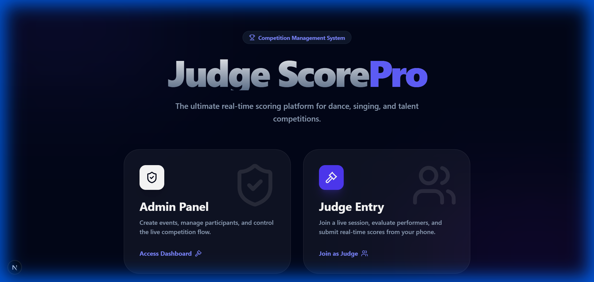

# 🏆 Judge Score Pro

**Real-time Competition Scoring & Leaderboard Management System**




Judge Score Pro is a premium, mobile-first web application designed for professional competitions, talent shows, and award events. It provides a seamless, real-time experience for judges to submit scores and for admins to manage participants and display live leaderboards.

---

## ✨ Key Features

### 👨‍⚖️ For Judges
- **Mobile-First Scoring**: A responsive interface optimized for smartphones and tablets.
- **Unique Passcodes**: Secure authentication with unique 8-character passcodes generated for each judge.
- **One-Click Invite Links**: Direct login URLs for frictionless judge onboarding.
- **Real-Time Sync**: Criteria and active participants update instantly without page refreshes.

### 🛠️ For Admins
- **Interactive Dashboard**: Create events, manage participants, and authorize judges from a single glassmorphism UI.
- **Live Submission Tracker**: Monitor judge submissions in real-time as they come in.
- **WhatsApp Integration**: Share judge invite links directly via WhatsApp with one click.
- **Official PDF Reports**: Generate professional, branded ranking reports and detailed judge-by-judge score breakdowns.

### 📊 Live Results
- **Premium Leaderboard**: Real-time rankings with tie-handling and "Check Judge Scores" deep-dive functionality.
- **Live Now Mode**: Highlights the current performer to keep the audience and judges in sync.

---

## 🚀 Tech Stack

- **Frontend**: Next.js 15, React 19, Tailwind CSS
- **Backend**: Next.js API Routes (Serverless)
- **Database**: MongoDB (with `mongodb` driver)
- **Real-time**: Pusher Channels
- **PDF Generation**: jsPDF & AutoTable
- **Icons**: Lucide React
- **Styling**: Vanilla CSS + Tailwind (Glassmorphism design system)

---

> [!NOTE]
> **Designed and Developed by Aditya Tawade**  
> Powered by Modern Web Technologies (Next.js & MongoDB)

---

## 🛠️ Installation & Setup

### Prerequisites
- Node.js 18+
- MongoDB Atlas (or local instance)
- Pusher Channels Account

### 1. Clone the Repository
```bash
git clone https://github.com/aditya-tawade/Judge-ScorePro.git
cd Judge-ScorePro
```

### 2. Install Dependencies
```bash
npm install
```

### 3. Environment Configuration
Create a `.env.local` file in the root directory and add the variables listed below.

#### 🛰️ Pusher Configuration Guide
To get your Pusher credentials for real-time features:
1.  **Sign Up**: Create a free account at [Pusher.com](https://pusher.com/).
2.  **Create App**: Go to "Channels" -> "Create App".
3.  **Name & Cluster**: Give it a name (e.g., "ScorePro") and select the cluster closest to you.
4.  **App Keys**: Once created, click on **"App Keys"** in the sidebar.
5.  **Copy to ENV**: Copy the values into your `.env.local` as shown below:

```env
# MongoDB
MONGODB_URI=your_mongodb_connection_string

# Pusher (Copy from your Pusher App Keys)
PUSHER_APP_ID="your_app_id"
PUSHER_KEY="your_key"
PUSHER_SECRET="your_secret"
PUSHER_CLUSTER="your_cluster"

# Public Pusher (Required for Client-side)
NEXT_PUBLIC_PUSHER_KEY="your_key"
NEXT_PUBLIC_PUSHER_CLUSTER="your_cluster"

# Admin Access
ADMIN_USERNAME=admin
ADMIN_PASSWORD=admin
```

### 4. Run Development Server
```bash
npm run dev
```
Open [http://localhost:3000](http://localhost:3000) to see the application.

---

## 📖 Usage Guide

1.  **Admin Setup**: Log in to `/admin` using the credentials in your `.env`.
2.  **Create Event**: Add your criteria (e.g., Performance, Technique) and participants.
3.  **Authorize Judges**: Add judges to receive unique passcodes and invite links.
4.  **Judging**: Share links with judges. They will see the "Active" participant and criteria live.
5.  **Results**: Go to the "Leaderboard" to see rankings update instantly and export the official PDF when the event ends.

---

## 🤝 Contributing

Contributions are what make the open-source community such an amazing place to learn, inspire, and create. Any contributions you make are **greatly appreciated**.

1. Fork the Project
2. Create your Feature Branch (`git checkout -b feature/AmazingFeature`)
3. Commit your Changes (`git commit -m 'Add some AmazingFeature'`)
4. Push to the Branch (`git push origin feature/AmazingFeature`)
5. Open a Pull Request

---

## 📜 License

Distributed under the MIT License. See `LICENSE` for more information.

---

## 📞 Support & SEO

- **Keywords**: Judge Scoring System, Real-time Leaderboard, Talent Show Management, Competition App, Next.js MongoDB Pusher.
- **SEO Optimization**: GitHub repository tags and metadata are optimized for discovery in judge-management and scoring categories.
